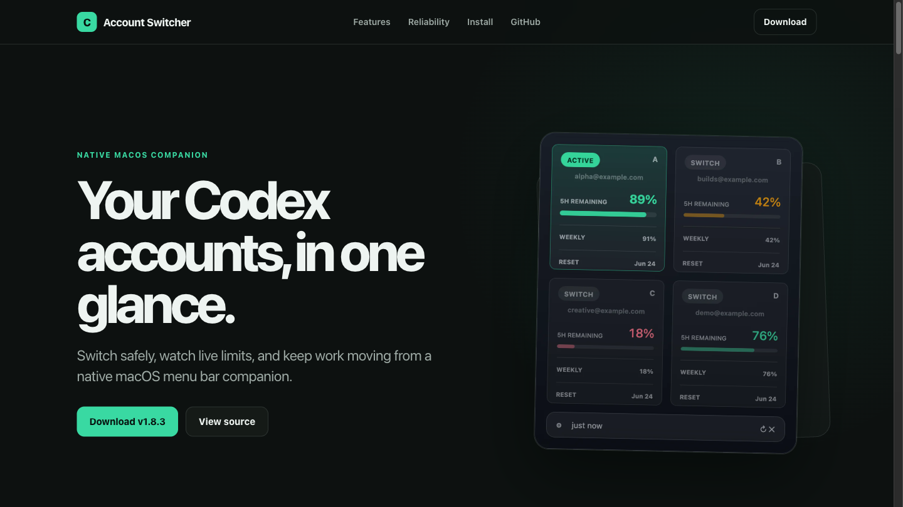

<p align="center">
  <a href="https://lordydord.github.io/Codex-Account-Switcher/">
    
  </a>
</p>

<p align="center">
  <a href="https://lordydord.github.io/Codex-Account-Switcher/"><strong>Product site</strong></a>
  &nbsp;&nbsp;|&nbsp;&nbsp;
  <a href="https://github.com/lordydord/Codex-Account-Switcher/releases/latest"><strong>Download</strong></a>
  &nbsp;&nbsp;|&nbsp;&nbsp;
  <a href="#build-from-source"><strong>Build from source</strong></a>
</p>

<p align="center">
  
  
  
  
  
</p>

# Codex Account Switcher

Codex Account Switcher is a native macOS menu bar companion for people who use more than one ChatGPT account with Codex. It shows live account limits, makes the active account obvious, verifies switches, and can help continue work when a quota runs out.

## The useful parts, immediately

- **Live account limits** for five-hour and weekly usage windows.
- **Fast account switching** from a compact four-account panel.
- **Verified changes** with target checks and automatic rollback on failure.
- **Reset-credit tracking** across saved accounts, grouped by expiry urgency.
- **Optional auto-switching** when the active account reaches a chosen threshold.
- **Optional task continuation** after a successful automatic switch.
- **ChatGPT lifecycle following** so the companion opens and closes with the desktop app.
- **Local diagnostics** that omit credentials, account IDs, and private usage snapshots.

<p align="center">
  
</p>

<table>
  <tr>
    <td width="50%"></td>
    <td width="50%"></td>
  </tr>
</table>

<p align="center">
  
</p>

## Install v1.8.3.1

1. Download `Codex-Account-Switcher-v1.8.3.1.zip` from the [latest release](https://github.com/lordydord/Codex-Account-Switcher/releases/latest).
2. Extract the archive and move `Codex Account Switcher.app` to Applications.
3. Right-click the app and choose **Open** on first launch if macOS asks.
4. Install and configure [`codex-auth`](https://www.npmjs.com/package/@loongphy/codex-auth):

```bash
npm install -g @loongphy/codex-auth
codex-auth login
```

Repeat `codex-auth login` for each account you want to use.

The release is ad-hoc signed and includes a SHA-256 checksum. It is not Apple-notarized, so macOS may show the standard warning for independently distributed software.

## Requirements

- macOS 14 or later
- ChatGPT Desktop in `/Applications/ChatGPT.app`
- Legacy `/Applications/Codex.app` is also supported
- `codex-auth` with at least one saved ChatGPT account
- Xcode command line tools only when building from source

## How switching stays safe

Codex Desktop must relaunch after an account change. The switcher asks `codex-auth` to change accounts, verifies that the requested target became active, then relaunches ChatGPT. If verification fails, it restores the previous account and reports the failure.

Automatic selection considers both usage windows, login health, reset credits, and a cooldown that prevents rapid switching between accounts.

## Reset credits

The reset-credit screen reads available credits for every saved account, groups them by account, and highlights expiry urgency. Spending a credit always requires confirmation. The switcher does not automatically retry a spending request and only reports success after the credit and refreshed usage state agree.

## Build from source

```bash
git clone https://github.com/lordydord/Codex-Account-Switcher.git
cd Codex-Account-Switcher
./run-tests.sh
./build.sh
./install.sh
./verify-install.sh
```

The built app is written to `build/Codex Account Switcher.app` and the install script copies it to `/Applications`.

Create a checked release archive with:

```bash
./package-release.sh
```

## Privacy

This repository does not contain ChatGPT credentials, auth tokens, account IDs, account registries, real email addresses, or private usage snapshots. Public screenshots use demo accounts and placeholder labels.

The switcher works with local `codex-auth` sessions. It does not add analytics, advertising, or a separate cloud account.

## Version 1.8.3.1

Version 1.8.3.1 fixes post-reset usage displays that could remain stuck at 0%, makes manual refresh read the live usage endpoint, keeps checking while ChatGPT applies a reset, and presents reset confirmation centrally instead of beneath the menu-bar panel.

See every published build on the [Releases page](https://github.com/lordydord/Codex-Account-Switcher/releases).

## Project map

```text
Sources/main.swift             AppKit application and account workflows
Sources/AppInfrastructure.swift  Networking, commands, and shared infrastructure
Sources/LifecycleMonitor.swift Native ChatGPT lifecycle companion
Tests                         Infrastructure and reset-logic regression checks
docs                          GitHub Pages product site
assets                        Privacy-safe app screenshots and repository artwork
```

## License

MIT. See [LICENSE](LICENSE).
