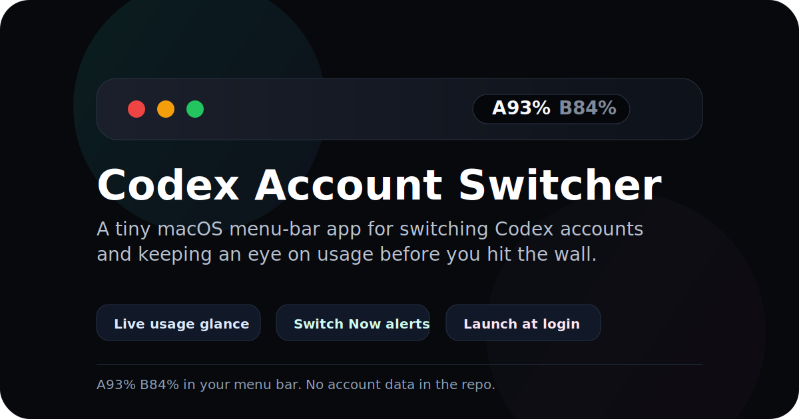

<p align="center">
  
</p>

<h1 align="center">Codex Account Switcher</h1>

<p align="center">
  <strong>A tiny native macOS menu-bar app for switching Codex / ChatGPT accounts before your usage limit gets in the way.</strong>
</p>

<p align="center">
  <a href="https://developer.apple.com/swift/"></a>
  
  
  <a href="https://github.com/lordydord/Codex-Account-Switcher/releases/tag/v1.32"></a>
  <a href="./LICENSE"></a>
</p>

<p align="center">
  <a href="https://github.com/lordydord/Codex-Account-Switcher/releases/download/v1.32/Codex-Account-Switcher-v1.32.zip"><strong>Download v1.32</strong></a>
  ·
  <a href="#install"><strong>Install from source</strong></a>
  ·
  <a href="#how-switching-works"><strong>How switching works</strong></a>
</p>

## Why

If you use the Codex Desktop app heavily, swapping between personal and work ChatGPT accounts can be clunky. Codex Account Switcher puts the useful bits in your menu bar:

- weekly usage for each saved account at a glance
- active account highlighted, inactive accounts dimmed
- saved accounts' 5-hour usage in the dropdown
- one-click switching with Codex relaunch
- optional automatic switching when the active account drops below your chosen 5-hour usage threshold
- low-usage notification with a `Switch Now` action
- a compact click-to-open account panel for quick switching and settings

It is deliberately small: a single Swift/AppKit menu-bar app for Codex Desktop that talks to [`codex-auth`](https://www.npmjs.com/package/@loongphy/codex-auth).

## What It Looks Like

<p align="center">
  <strong>Menu-bar status</strong><br>
  
</p>

<p align="center">
  <strong>Account panel</strong><br>
  
</p>

<p align="center">
  <strong>Settings panel</strong><br>
  
</p>


By default, each account uses the first letter or number from its email address. For example:

- `alice@example.com` becomes `A`
- `builds@example.com` becomes `B`

You can switch the menu bar to a smaller `A93 B84` style, or override account labels from the menu if you prefer custom initials.

## Features

- Menu-bar usage display with weekly or 5-hour usage, active account color, large percentage and small compact styles.
- Click-to-open account panel with 5-hour rings, weekly progress, refresh, settings, and close controls.
- Compact 2x2 account panel layout for three or four saved accounts.
- Bright active account card and dim inactive accounts, with green, orange, and red status colors reflected in the active card background.
- Dropdown showing 5-hour usage for all saved accounts.
- Email-based switching, avoiding brittle numeric selectors.
- Optional panel-card confirmation: first click arms the inactive card, second click on the highlighted switch pill confirms the account change.
- Codex relaunch after switching so Desktop picks up the new account.
- Configurable notification and auto-switch thresholds.
- Optional auto-switching from a low-usage active account to another saved account.
- `Switch Now` notification action for low usage.
- Refresh interval controls for active and idle states.
- In-panel settings for display mode, launch-at-login, usage reminders, card confirmation, auto-switching, account actions, health checks, and maintenance.
- Account backup cleanup.
- No bundled credentials, tokens, account registry, or usage snapshots.

## Requirements

- macOS 14 or later.
- Xcode command line tools / Swift compiler.
- Codex Desktop installed at `/Applications/Codex.app`.
- [`codex-auth`](https://www.npmjs.com/package/@loongphy/codex-auth) installed and configured.

Install `codex-auth`:

```bash
npm install -g @loongphy/codex-auth
```

Add accounts:

```bash
codex-auth login
```

Repeat login for each account you want to switch between.

## Build

```bash
./build.sh
```

The app bundle is created at:

```text
build/Codex Account Switcher.app
```

## Install

```bash
./install.sh
```

This installs to:

```text
/Applications/Codex Account Switcher.app
```

## Run Without Installing

```bash
./run.sh
```

## How Switching Works

Codex Desktop needs to be relaunched after an account switch before the newly active account takes effect. This app handles that relaunch as part of switching.

The app uses `codex-auth switch <email-query>` internally, so it does not depend on account numbers such as `01` or `02`.

## Privacy Notes

This repository does not contain account credentials, tokens, account IDs, local auth files, usage registries, or personal account data.

Screenshots are generated from demo account data and should stay that way for future releases.

Usage refresh depends on `codex-auth` and normal saved ChatGPT account sessions. API token mode is disabled in the current local build.

## Releases

- Version 1.32: improves usage refresh freshness when values do not numerically change, clarifies inactive local snapshots, and refines the account panel so inactive accounts keep their green/orange/red usage colours while active accounts stand out with stronger weight and saturation.
- Version 1.31: smooths the menu-bar percentage display on newer macOS releases, tightens the percentage padding, restores click-again-to-close behavior for the menu-bar panel, and keeps the recent three/four-account compact grid, expired-login detection, safer Codex relaunch handling, and ChatGPT-account-only switching updates.
- Version 1.3: adds panel-card switch confirmation, account-label edit badges, a shorter account panel, cleaner compact Settings layout, compact Settings health checks, clearer refresh/stale status text, and tooltips on icon-only controls.
- Version 1.2.2: fixes menu-bar percentage display issues and makes usage readings more stable when live Codex usage data is unavailable. Includes recent compact panel design refinements, clearer account controls, reset-time display polish, and lighter active/inactive visual styling.
- Version 1.2.1: matches the in-app active account card, border, 5-hour ring, label, and active pill to the same green/orange/red usage status colors used in the menu bar, with light and dark mode background tints.
- Version 1.2: adds the compact modern account panel redesign, in-panel settings redesign, visible account email labels, active account menu-bar usage colors, and a weekly/5-hour menu-bar usage selector.
- Version 1.1: adds the account panel UI and dialog-based settings controls.
- Version 1.00: first public release.

## Roadmap Ideas

- Signed release builds.
- Homebrew cask.
- Preferences window if the menu grows too large.
- Optional sound or banner style settings for switch prompts.

## License

MIT. See [LICENSE](./LICENSE).
