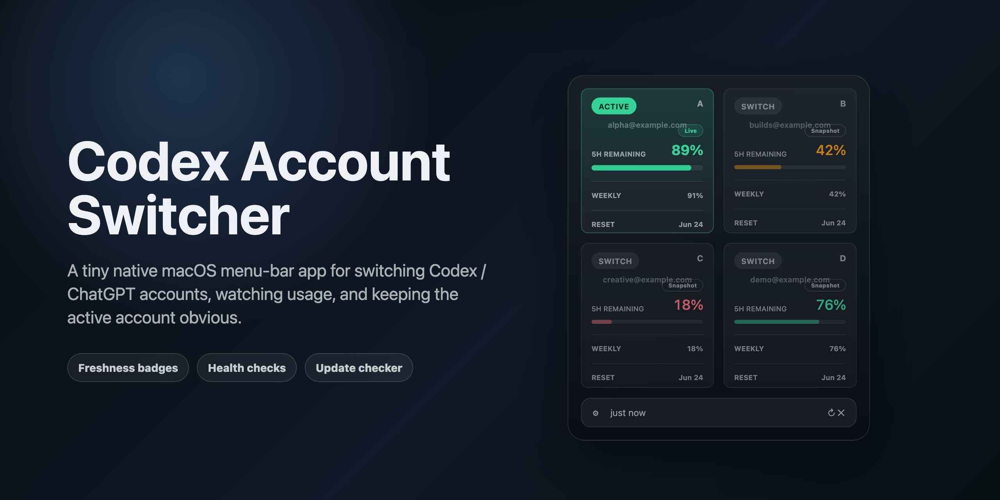
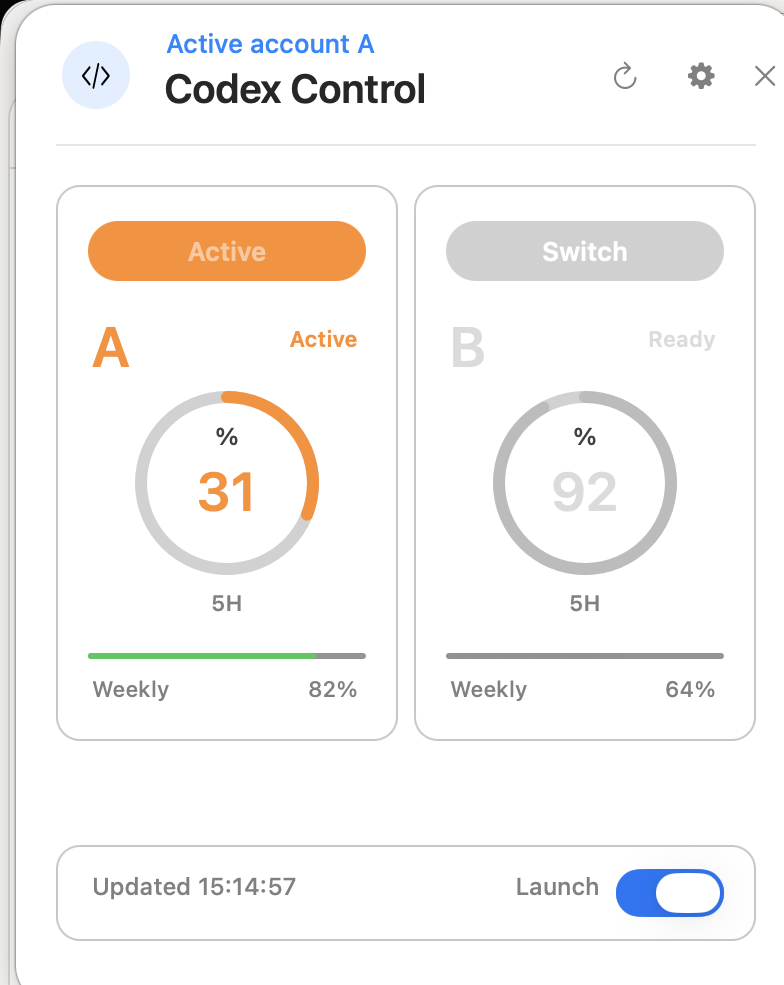
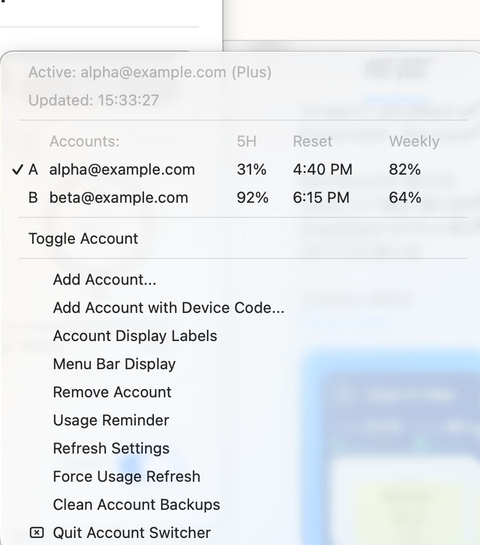
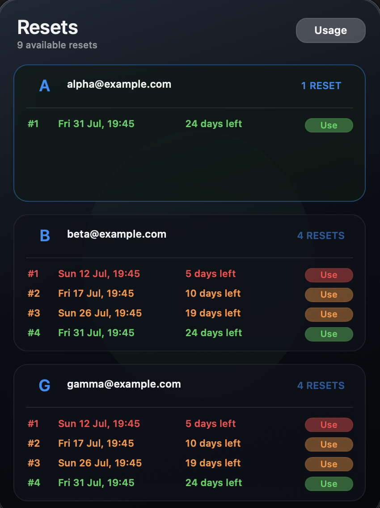

<p align="center">
  
</p>

<h1 align="center">Codex Account Switcher</h1>

<p align="center">
  <strong>A tiny native macOS menu-bar app for switching Codex / ChatGPT accounts, watching usage, and keeping the active account obvious.</strong>
</p>

<p align="center">
  <a href="https://developer.apple.com/swift/"></a>
  
  
  
  <a href="./LICENSE"></a>
</p>

<p align="center">
  <a href="https://github.com/lordydord/Codex-Account-Switcher/releases/download/v1.7/Codex-Account-Switcher-v1.7.zip"><strong>Download v1.7</strong></a>
  ·
  <a href="#install"><strong>Install from source</strong></a>
  ·
  <a href="#how-switching-works"><strong>How switching works</strong></a>
</p>

## Why

If you use the Codex Desktop app heavily, swapping between personal and work ChatGPT accounts can be clunky. Codex Account Switcher puts the useful bits in your menu bar:

- active account usage in the menu bar
- 5-hour and weekly usage in a compact account panel
- reset-credit tracking across saved accounts, including expiry urgency colours
- clearer active and inactive account styling without extra panel badges
- safer switch previews before relaunching Codex
- health checks for `codex-auth`, ChatGPT/Codex, notifications, refresh freshness, and updates
- optional automatic switching and resume prompts when quota gets tight

It is deliberately small: a single Swift/AppKit menu-bar app for Codex Desktop that talks to [`codex-auth`](https://www.npmjs.com/package/@loongphy/codex-auth).

## What It Looks Like

<p align="center">
  
</p>

<table>
  <tr>
    <td width="50%">
      
    </td>
    <td width="50%">
      
    </td>
  </tr>
</table>

<p align="center">
  
</p>

The reset-credit view is one of the main reasons to use the switcher: it can show available Codex reset credits across saved accounts, group them by account, color-code expiry urgency, and keep each reset behind an explicit confirmation before anything is spent.

By default, each account uses the first letter or number from its email address. For example:

- `alice@example.com` becomes `A`
- `builds@example.com` becomes `B`

You can switch the menu bar to a smaller `A93 B84` style, or override account labels from the menu if you prefer custom initials.

## Features

- Menu-bar usage display with weekly or 5-hour usage, active account color, large percentage and small compact styles.
- Click-to-open account panel with 5-hour rings, weekly progress, refresh, settings, and close controls.
- In-window reset-credit screen grouped by account, with color-coded expiry urgency and guarded redemption.
- Compact 2x2 account panel layout for three or four saved accounts.
- Bright active account card and dim inactive accounts, with green, orange, and red status colours retained across cards.
- Dropdown showing 5-hour usage for all saved accounts.
- Email-based switching, avoiding brittle numeric selectors.
- Optional panel-card confirmation plus switch previews showing target 5-hour and weekly usage.
- Codex relaunch after switching so Desktop picks up the new account.
- Optional **Follow Codex / ChatGPT** lifecycle mode: opens the switcher when either desktop surface opens, then closes it only after both have been absent for 5 seconds. The grace period keeps the switcher alive during its own account-change relaunch.
- Configurable notification and auto-switch thresholds.
- Optional auto-switching from a low-usage active account to another saved account.
- Transactional switching with verification and automatic rollback on failure.
- Best-account scoring using both usage windows, reset credits, login health, and an anti-bounce cooldown.
- Event-driven native lifecycle monitoring without a two-second polling loop.
- Privacy-safe local switch history and copyable diagnostics.
- Clipboard restoration after automatic continuation.
- `Switch Now` notification action for low usage.
- Refresh interval controls for active and idle states.
- In-panel settings for display mode, launch-at-login, usage reminders, card confirmation, auto-switching, auto-resume, account actions, health checks, update checks, and maintenance.
- A safe Route B prototype with selectable OpenRouter text and visual helper profiles plus explicit ready, test-required, and blocked capability labels.
- Account backup cleanup.
- No bundled credentials, tokens, account registry, or usage snapshots.

## Route B Prototype

Open **Settings → OpenRouter** to inspect and switch the selected secondary-lane profile.

This first prototype deliberately stops at profile selection:

- `Text Helper` uses the public model identifier `z-ai/glm-5.2`.
- `Visual Helper` uses the public model identifier `z-ai/glm-5v-turbo`.
- Green labels are ready for the profile's narrow purpose.
- Orange labels require a smoke test before they can be enabled.
- Red labels are blocked.
- Selecting a profile stores only its public profile ID in macOS preferences.

Route B does not make provider requests, accept or store provider keys, change Codex configuration, or replace normal Codex Desktop account switching. Native Codex remains the default for sends, uploads, account changes, invoices, and other live operations.

## Requirements

- macOS 14 or later.
- Xcode command line tools / Swift compiler.
- ChatGPT Desktop installed at `/Applications/ChatGPT.app`; legacy `/Applications/Codex.app` remains supported.
- [`codex-auth`](https://www.npmjs.com/package/@loongphy/codex-auth) installed and configured.

Install `codex-auth`:

```bash
npm install -g @loongphy/codex-auth
```

Add accounts:

```bash
codex-auth login
```

Repeat login for each account you want to switch between.

## Build

```bash
./build.sh
```

The app bundle is created at:

```text
build/Codex Account Switcher.app
```

## Install

```bash
./install.sh
```

This installs to:

```text
/Applications/Codex Account Switcher.app
```

## Run Without Installing

```bash
./run.sh
```

## How Switching Works

Codex Desktop needs to be relaunched after an account switch before the newly active account takes effect. This app handles that relaunch as part of switching.

The app uses `codex-auth switch <email-query>` internally, so it does not depend on account numbers such as `01` or `02`.

## Privacy Notes

This repository does not contain account credentials, tokens, account IDs, local auth files, usage registries, or personal account data.

Screenshots are generated from demo account data and should stay that way for future releases.

Usage refresh depends on `codex-auth` and normal saved ChatGPT account sessions. API token mode is disabled in the current local build.

## Releases

- Version 1.7: reliability and efficiency update. Adds native event-driven lifecycle monitoring, verified switching with rollback, best-account scoring and cooldown, privacy-safe history and diagnostics, clipboard restoration, and ad-hoc signed release packages with SHA-256 checksums.

- Version 1.5: adds the in-window reset-credit screen, replacing the old floating reset submenu. Reset credits are grouped by account, sorted by expiry, color-coded by time left (green for 20+ days, orange for 8-20 days, red for 7 days or less), and use slimmer guarded action buttons. This release also includes the safe Route B profile-selection prototype and refreshed README screenshots/docs.
- Version 1.4: major reset-credit update. The switcher now checks reset credits across every saved Codex account, shows the total resets available in the compact panel bar, and opens a per-account breakdown with each reset credit's grant time and expiry date. Reset rows can be redeemed from the menu after an explicit confirmation, then the app refreshes usage and reset-credit state so you can see the new limits immediately.
- Version 1.34: removes per-account live/snapshot badges from the panel, keeps clearer active/inactive account styling, and refreshes public screenshots without badge overlays.
- Version 1.33: adds switch previews, expanded health checks, GitHub update checking, clearer refresh wording, better empty/error actions, and refreshed public screenshots/README presentation.
- Version 1.32: improves usage refresh freshness when values do not numerically change, clarifies inactive local snapshots, and refines the account panel so inactive accounts keep their green/orange/red usage colours while active accounts stand out with stronger weight and saturation.
- Version 1.31: smooths the menu-bar percentage display on newer macOS releases, tightens the percentage padding, restores click-again-to-close behavior for the menu-bar panel, and keeps the recent three/four-account compact grid, expired-login detection, safer Codex relaunch handling, and ChatGPT-account-only switching updates.
- Version 1.3: adds panel-card switch confirmation, account-label edit badges, a shorter account panel, cleaner compact Settings layout, compact Settings health checks, clearer refresh/stale status text, and tooltips on icon-only controls.
- Version 1.2.2: fixes menu-bar percentage display issues and makes usage readings more stable when live Codex usage data is unavailable. Includes recent compact panel design refinements, clearer account controls, reset-time display polish, and lighter active/inactive visual styling.
- Version 1.2.1: matches the in-app active account card, border, 5-hour ring, label, and active pill to the same green/orange/red usage status colors used in the menu bar, with light and dark mode background tints.
- Version 1.2: adds the compact modern account panel redesign, in-panel settings redesign, visible account email labels, active account menu-bar usage colors, and a weekly/5-hour menu-bar usage selector.
- Version 1.1: adds the account panel UI and dialog-based settings controls.
- Version 1.00: first public release.

## Unsigned Distribution

Version 1.7 uses ad-hoc code signing and SHA-256 checksums. This improves local bundle integrity without a paid Apple Developer account, but it cannot provide Apple notarization or remove every first-launch Gatekeeper warning. Build a checked package with `./package-release.sh` and verify an installation with `./verify-install.sh`.

## Roadmap Ideas

- Developer ID signing and notarization if the project later gains an Apple Developer account.
- Homebrew cask.
- Preferences window if the menu grows too large.
- Optional sound or banner style settings for switch prompts.

## License

MIT. See [LICENSE](./LICENSE).
