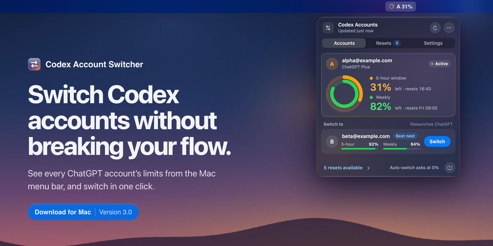
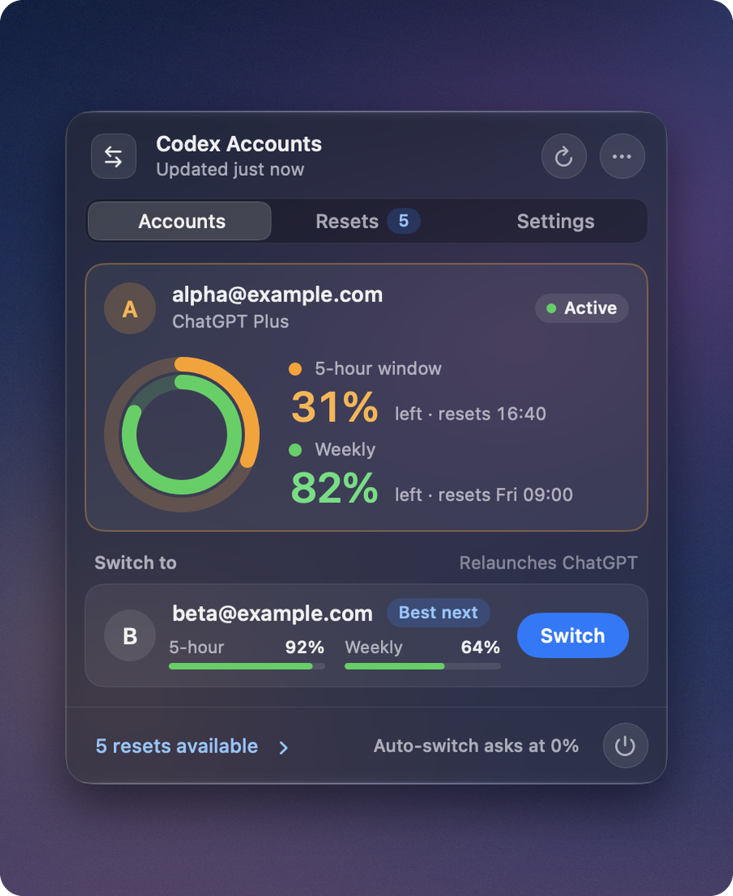
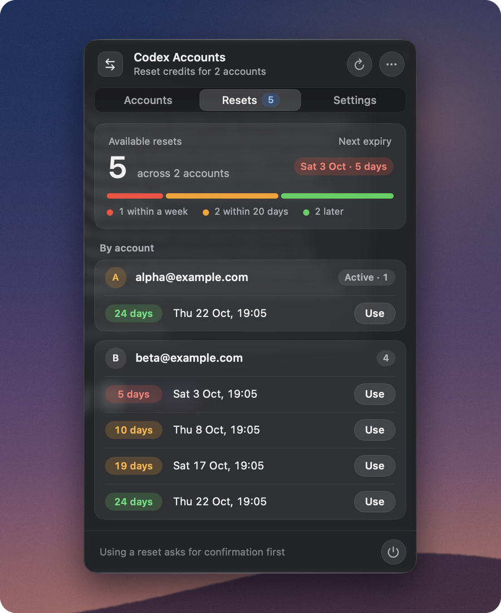
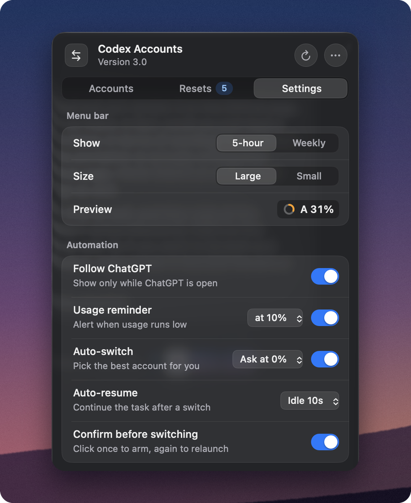

<p align="center">
  <a href="https://lordydord.github.io/Codex-Account-Switcher/">
    
  </a>
</p>

<h1 align="center">Codex Account Switcher</h1>

<p align="center">
  Switch Codex accounts without breaking your flow.<br>
  A free menu bar app for Mac that shows how much of each ChatGPT account’s Codex limit is left, and switches accounts in one click.
</p>

<p align="center">
  <a href="https://github.com/lordydord/Codex-Account-Switcher/releases/latest"><strong>Download for Mac</strong></a>
  &nbsp;·&nbsp;
  <a href="https://lordydord.github.io/Codex-Account-Switcher/">Website</a>
  &nbsp;·&nbsp;
  <a href="CHANGELOG.md">What’s new</a>
</p>

<p align="center">
  
  
  
  
</p>

---

## What it does

If you use Codex with more than one ChatGPT account, you know the routine: a limit runs out mid-task, you sign out, sign in to another account, and hope it has room. Codex Account Switcher takes care of that from the menu bar.

- **See every limit at once.** The 5-hour and weekly limits for each saved account, updated live.
- **Switch in one click.** It saves your session, changes account, checks the change worked, then reopens ChatGPT. If anything goes wrong, it puts the previous account back.
- **Know which account to use next.** The account with the most room left is marked “Best next”.
- **Use reset credits before they expire.** Every credit across your accounts, soonest first, with a confirmation before any is spent.
- **Let it run itself.** Optional auto-switch when a limit gets low, auto-resume to carry on the task, and usage reminders.

<table>
  <tr>
    <td width="33%" valign="top"></td>
    <td width="33%" valign="top"></td>
    <td width="33%" valign="top"></td>
  </tr>
  <tr>
    <td align="center"><sub>Accounts</sub></td>
    <td align="center"><sub>Resets</sub></td>
    <td align="center"><sub>Settings</sub></td>
  </tr>
</table>

## New in 3.0

A ground-up redesign for macOS 27, and a much lighter app underneath.

- **Liquid Glass throughout.** One glass panel with a standard toolbar and tabs, in light and dark.
- **Limits you can read at a glance.** Rings for the active account, slim meters for the rest.
- **A calmer menu bar item.** A small usage ring that only turns red when you’re nearly out.
- **Faster.** Switches finish seconds sooner, the panel opens instantly, and the app does far less in the background.

Read the [full release notes](docs/release-notes/v3.0.md).

## Install

1. Download the latest version from [Releases](https://github.com/lordydord/Codex-Account-Switcher/releases/latest), unzip it and move **Codex Account Switcher** to Applications.
2. The app isn’t notarised yet, so the first time, right-click it and choose **Open**.
3. Install [codex-auth](https://www.npmjs.com/package/@loongphy/codex-auth) and sign in once for each ChatGPT account:

   ```bash
   npm install -g @loongphy/codex-auth
   codex-auth login
   ```

**You’ll need:** macOS 14 or later (designed for macOS 27), the ChatGPT desktop app in Applications, and codex-auth.

Each release includes a SHA-256 checksum so you can check the download.

## How switching works

Every switch follows the same routine:

1. Save the current session, so nothing is lost.
2. Ask codex-auth to change account, then confirm the new account really is active.
3. If it isn’t, restore the previous account and explain what happened.
4. Quit and reopen ChatGPT on the new account.

Auto-switch waits a short cooldown between switches, so it never bounces back and forth.

Reset credits work the same careful way: using one always asks first. The app never retries a spend on its own, and only reports success once ChatGPT confirms the limit was reset.

## Privacy

- The app uses the sign-ins codex-auth already keeps on your Mac. It adds no analytics, no adverts and no extra account.
- Your sign-ins are only used to talk to ChatGPT, to check your limits and reset credits.
- This repository contains no credentials, tokens, account IDs or real email addresses. Every screenshot uses demo accounts.
- **Diagnostics** in the ••• menu copies a health report you can share, without tokens or account IDs.

## Build from source

You’ll need the Xcode command line tools.

```bash
git clone https://github.com/lordydord/Codex-Account-Switcher.git
cd Codex-Account-Switcher
./run-tests.sh      # infrastructure and reset-logic checks
./build.sh          # builds build/Codex Account Switcher.app
./install.sh        # copies it to /Applications
```

`./package-release.sh` creates a verified release zip and checksum.

<details>
<summary>Project layout</summary>

```text
Sources/main.swift               App delegate, account workflows, switching and resets
Sources/AccountPanelView.swift   The menu bar panel: Accounts, Resets, Settings
Sources/PanelComponents.swift    Liquid Glass controls, rings, meters and menu bar glyphs
Sources/Models.swift             Shared models and the panel theme
Sources/AppInfrastructure.swift  Commands, networking and shared policies
Sources/LifecycleMonitor.swift   Opens and closes the switcher alongside ChatGPT
Tests/                           Infrastructure checks
docs/                            The website (GitHub Pages)
```

</details>

## Licence

MIT. See [LICENSE](LICENSE).

Codex Account Switcher is an independent open-source project. It isn’t affiliated with or endorsed by OpenAI.
